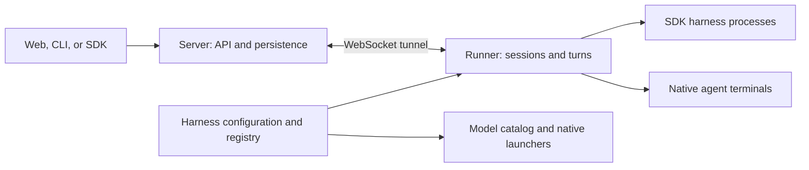

# Architecture

Omnigent has two long-lived owners: the server owns persisted sessions and
routes requests; the runner owns the processes that execute those sessions.
Harnesses adapt individual coding agents to the runner's contract.



## Where to make a change

| Responsibility | Owner |
| --- | --- |
| HTTP routes, authentication, persistence, runner selection | `omnigent/server/` |
| Server startup, rollback, and shutdown | `omnigent/server/lifecycle.py` |
| Session initialization, turns, tools, process and terminal ownership | `omnigent/runner/` |
| Compose a harness launch environment and session overrides | `omnigent/runner/launch.py` |
| Resolve providers, credentials, and model defaults | `omnigent/harnesses/config/providers.py` |
| Translate an agent spec into harness environment variables | `omnigent/harnesses/config/spawn_env.py` |
| Register harness identities, capabilities, and lazy builder paths | `omnigent/harness_plugins.py` |
| Adapt SDK events and native terminal behavior | `omnigent/inner/` and `omnigent/harnesses/` |
| Shared history, prompt, policy, and compaction operations | `omnigent/runtime/` |
| Parse and resolve portable agent specifications | `omnigent/spec/` |

Provider and environment modules do not initialize or look up runtime services.
Model discovery can reuse provider resolution without loading server
orchestration or needing initialized stores. The model catalog imports provider
helpers lazily because provider resolution also consults the catalog.

SDK launch builders register in `HarnessContribution.spawn_env_builders`.
The runner resolves one builder with the common `spec`, `cwd`, and `workdir`
signature, then applies session settings. Generic ACP CLI launches also need
the catalog harness and session ID. Native terminal launch remains a separate
lifecycle, registered through `NativeHarnessProvider`.

## Ownership and lifetime

The runner owns `HarnessProcessManager` and `SessionResourceRegistry`. The
server does not create unused copies of either. Its lifecycle owns the runner
router, background services, MCP pool, and the terminal registry used by
embedded operation. Cleanup is registered as resources are acquired so a
partially completed startup can release what it already owns.

`RuntimeServices` replaces independent module globals with one typed service
object. It is process-scoped: it does not promise isolation between multiple
server apps in one Python process. The public `runtime.init` and getter/setter
API still work. Pass dependencies explicitly for new library operations;
`CompactionServices` is the compaction entry point's dependency contract.

Request and workspace context remain separate from process services. Moving
dependencies must not turn workspace data, session routing, or credentials
into shared caches. Framework instructions still compose in
`runtime/prompt.py`, after user-authored instructions.

## Compatibility

HTTP routes, stored data, agent YAML, harness names, and launch environment
values retain their existing contracts. `runtime/workflow.py` is a deprecated
import adapter scheduled for removal in 0.18. It is not an agent loop; internal
callers import the owning modules directly. Legacy runtime dispatch and unused
server resource accessors have the same 0.18 removal target.

Tests patch the module that owns a function. Import adapters do not forward
monkeypatches between modules.

## Verification

Install the Python development environment and run the affected area suites:

```sh
uv sync --frozen --extra all --group dev
uv run --no-sync pytest tests/runtime tests/runner tests/server tests/spec tests/tools -n 8 --dist worksteal -m 'not databricks'
uv run --no-sync pytest tests/integration --harness openai-agents
uv run --no-sync pyrefly check
```

The integration suite starts its own server, runner, and mock model. A mock run
checks Omnigent's transport and lifecycle contracts; it does not establish
compatibility with a live vendor service.

For a manual check, run `omnidev` from this checkout and open the displayed UI
URL. Start a session, send a message that uses a tool, send a follow-up, stop a
running turn, and resume it. Check model changes and `/compact`, then stop
`omnidev` and start it again: the session history should still load and a new
turn should run. Repeat with an SDK harness and a native harness available on
your machine.
